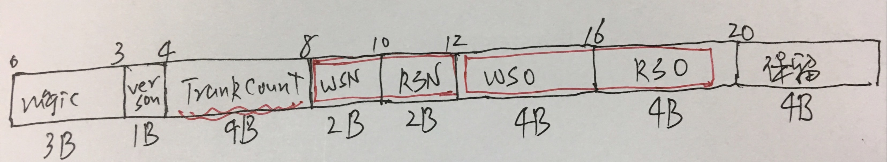
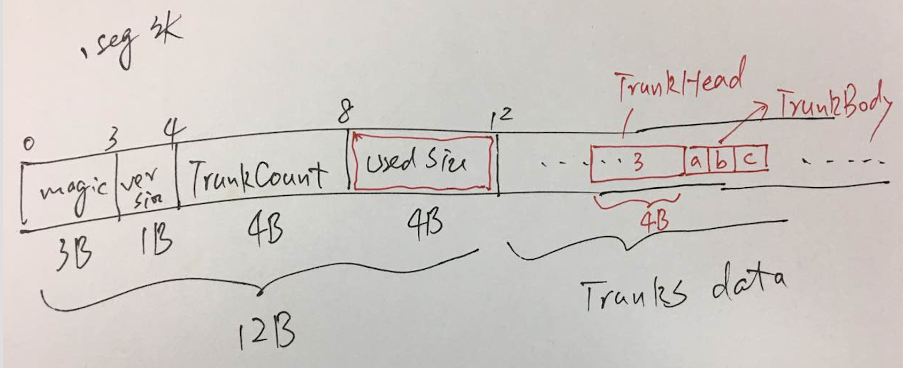

# BSF开发者指南

## 文件结构

### ``.bsf`` 头

**提醒**
>所有整形数（包括：Int和Short），序列化到文件时，都采用``Big Endian``（即：网络序）。如果您用C语言去解析``.bsf``头，请格外注意编译环境；如果您用Java解析，则一致的（Java默认是``Big Endian``）。

### ``.seg`` 头

``segment``有个12B的固定头部。最必要的信息是第4个字段``usedSize``，表示``segment``文件的实际使用大小。您可能会说，为什么需要额外存储这个值？文件大小难道不是操作系统的文件系统就管理了的吗？！主要是因为实现时，底层采用了``内存映射``机制，每次映射了``BSFConf.segmentLimitBytes``大小，默认值是128MB，相当于每次``segment``都是以128MB为单位分配，无论它实际是否用到。

另外，每次追加的``trunk``的结构很简单：一个``trunk-head``表示``trunk-body``的字节数，紧随其后的就是``trunk-body``。它没有像``kafka``这类系统设计一定的头部字段，比如时间戳呀，``key``字段呀。

-----

## Tips

- [x] 二进制协议整型数序列化采用网络序，既``Big Endian``。避免C与Java的不兼容。
- [x] 基于文件的单元测试：在系统临时文件夹下生成临时文件，单测完成后，自动删除。详见 [BSFMetaTest.java](BSFMetaTest.java)
- [x] 数据文件也需增加头部字段：原本打算meta信息都存放在``.bsf``文件里，但是由于segment文件采用``内存映射``机制写文件，它会进行空间的预分配。刚写10个字节，就预分配了128MB，所以需要在文件的头部记录下``usedSize``。

## TODO

- [ ] 自动清理消费完的``segment``文件。

## 附录-1：实验

- [labs.md](labs.md)
